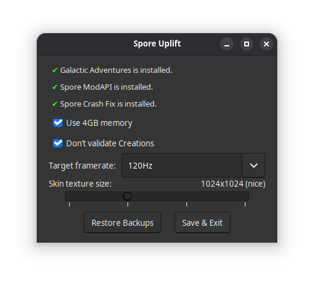

## How do I download this?

Looking for a download link? Here’s [the Releases page](https://github.com/SolraBizna/SporeUplift/releases).

## What is this?

Spore requires a few tweaks to run well on modern machines. These tweaks are widely known, but applying them is a pain. SporeUplift is a user-friendly way to apply some of them. It also lets you choose your desired framerate and skin texture size.

**You should only use SporeUplift if you are running Spore on a modern machine.**

Spore Crash Fix is also recommended. SporeUplift cannot install this itself.

SporeUplift requires Spore for Windows, ideally the most recent version available on GOG or the EA App. (It also works with the Steam version of Spore, but some fixes can’t be applied.)

SporeUplift requires Java 8 or later. (It’s almost impossible to get Java without getting Java 8 or later.)

## How do I use it?

Run SporeUplift. Press “Save &amp; Exit” and you’re done.

## How do I un-use it?

Run SporeUplift. Press “Restore Backups”. Everything will be as it was.

## The Tweaks

- **Hardware detection override**: Spore ships with a hardcoded list of known GPUs and some logic that limits what it will attempt to achieve based on what GPU and CPU you have. If your GPU isn’t in the list (which it probably isn’t, given how old the list is), Spore will assume your GPU sucks. SporeUplift replaces all of that logic with simple code that assumes your machine supports all features, **which is why you should only use it on a modern machine.**
- **Use 4GB memory**: By default, Spore only requests 2GB of memory. This is not enough to run it at high quality or on modern machines. We patch it to request up to 4GB of memory instead, using the same method applied by [NTCore’s 4GB patcher](https://ntcore.com/4gb-patch/). On one person’s machine, this patch alone brought the crash rate from “seven or eight per hour” to “one per week”. (SporeUplift cannot automatically apply this patch to the Steam version.)
- **Don’t validate Creations**: Some people, especially mod users, are unable to save certain Creations. This disables that safety check, allowing all Creations that can be made to be saved.
- **Target framerate**: Spore is hardcoded to target 30fps by default. Modern systems can handle much more. We provide a way to set what framerate you want to achieve.
- **Skin texture size**: By modern standards, Spore uses a very low resolution for textures it generates for Creations. We provide a way to increase that.
- **“Spore Graphics Fix” support**: There’s a patch floating around the Internet, usually called “Spore Graphics Fix” or something equivalent. We provide a skin texture size option equivalent to the one in that patch. We also preserve the other stuff the patch does, and expose those values in `ConfigManager.txt` so you can edit them if you want to. We don’t provide a way to edit these settings in the GUI.

## Why Java?

It allows SporeUplift to be both tiny and easy to analyze.

## Why Esperanto?

Because it’s the only language other than English that I know well enough to be confident in my translations of technical topics, and I needed to test the translation support.

Also:

## Legalese

SporeUplift is copyright 2026 Solra Bizna. 

SporeUplift is free software: you can redistribute it and/or modify it under the terms of the GNU General Public License as published by the Free Software Foundation, either version 3 of the License, or (at your option) any later version.

SporeUplift is distributed in the hope that it will be useful, but WITHOUT ANY WARRANTY; without even the implied warranty of MERCHANTABILITY or FITNESS FOR A PARTICULAR PURPOSE. See the GNU General Public License for more details.

[A copy of the GNU General Public License](COPYING) is included with the source code.

### In English, please?

You can do what you want with SporeUplift, except take away others’ ability to do what they want with it.

### Why didn’t you just say so?

Because law.

## AI Disclaimer

This program was produced entirely without the use of any Large Language Model. No chatbots. No agents. No spicy autocomplete. No claws, no gippities, no kimmies, no gwens or quoks or sparks. Period.
